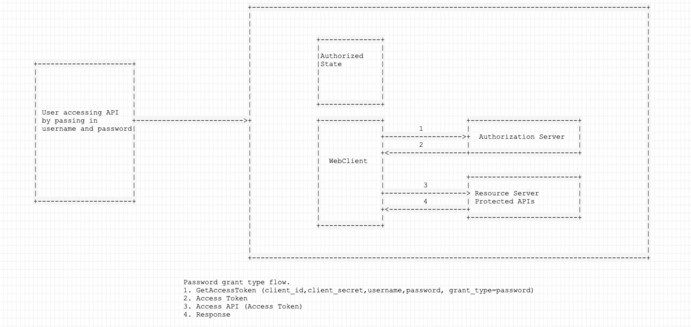

# WebClient-1

Accessing remote resources protected via OAuth2 grant-type password.

This sample code, uses webclient to access OAuth2 protected resource (1). It assumed you are using springboot application which invokes a remote API (2) protected by OAuth2 access token.

The remote service exposed two APIs. 
1) First API is access token API, which generates an opaque access token.
2) Second API is the resource API, accessible using the access token provided by first API.

The access token provided is OAuth2 (grant_type = password)

# Description

# 

